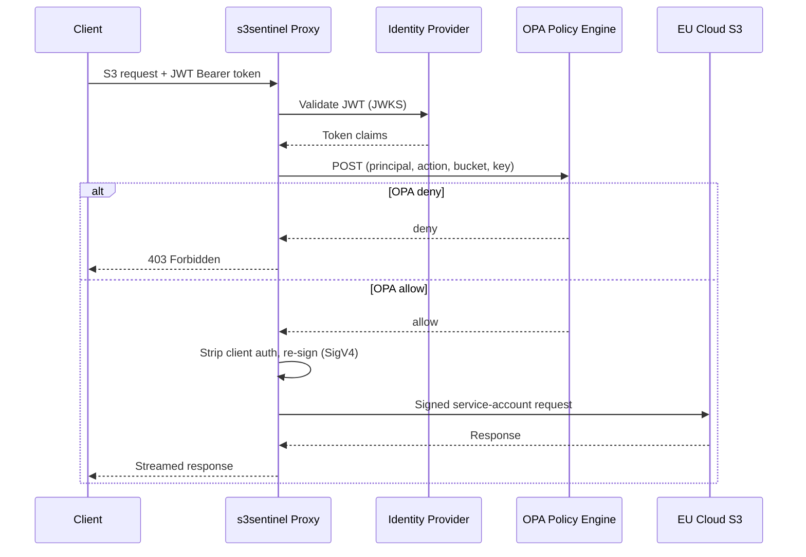

# Blog Post Outline: Fine-Grained S3 Permissions on EU Cloud with s3sentinel

**Audience**: Data engineers and data architects evaluating or already working on EU cloud data platforms. Familiar with the open source data platform from the previous two posts in the series. Know S3, understand access keys conceptually. May not know OPA or JWT in depth.

**Objective**: Reader feels the permission gap as a real problem, understands the proxy pattern as the solution, and walks away thinking "I could build or adapt this."

---

## 1. Hook — The Moment of Frustration

Open with the concrete pain a data engineer hits:

> "I need to restrict access to sensitive data. Some tables are HR-only, some buckets contain PII. But my EU cloud gives me one access key for the entire bucket — everyone gets everything or nothing."

This is not a hypothetical. It is the default state on OVHcloud, Scaleway, Exoscale, Hetzner, and most S3-compatible on-premise solutions.

---

## 2. EU Sovereignty Is Not Optional Anymore

Contextualise why this matters now:

- EU companies are increasingly evaluating EU cloud providers (data residency, GDPR, geopolitical risk)
- AWS/Azure/GCP are not always an option — regulatory, contractual, or strategic reasons
- EU cloud providers have solid fundamentals: pricing, performance, compliance posture
- But they often lack the enterprise-grade access control features that AWS IAM provides natively

This post is for the reader who is already asking: "Can we build a serious data platform on EU cloud?"

---

## 3. The Gap: One Key to Rule Them All

Explain the specific technical limitation:

- S3-compatible EU cloud storage typically offers one read/write key per bucket
- No identity federation, no per-path policies, no attribute-based access control
- The key is a shared secret — distribute it and you lose control; keep it centralised and you lose self-service

Briefly note what was evaluated and ruled out (MinIO Gateway deprecated, Apache Ranger scoped to Hadoop, Lakekeeper Iceberg-only) to show this is a real gap, not a solved problem.

---

## 4. The Building Blocks

Two short inline callouts — explain just enough to follow the architecture, link out for depth.

**JWT (JSON Web Token)**: A signed token issued by an identity provider (e.g. Keycloak, Azure AD). Contains claims about the user — who they are, what groups they belong to. The signature can be verified without calling the IdP on every request.

**OPA (Open Policy Agent)**: A policy engine that evaluates rules written in Rego. You describe *who can do what to which resource* as code. OPA returns allow or deny. It is embedded, fast (<1ms), and decoupled from application logic.

> *Links: [jwt.io](https://jwt.io), [openpolicyagent.org](https://www.openpolicyagent.org)*

---

## 5. The Proxy Architecture

s3sentinel sits between your clients and EU cloud S3. Clients speak standard S3 — the only change is they send a JWT instead of an AWS access key.

Key insight: **the EU cloud service account key never leaves the proxy**. Clients authenticate with JWT tokens issued by your identity provider. The proxy is the only component that holds the S3 credential.

Walk through each step:
1. Client sends S3 request with `Authorization: Bearer <JWT>`
2. Proxy validates JWT signature against IdP's JWKS endpoint
3. Proxy extracts principal, email, groups → asks OPA: "can this user do this action on this bucket/key?"
4. OPA evaluates the Rego policy → allow or deny
5. On allow: proxy strips client auth headers, re-signs with service account credentials (SigV4), forwards to EU S3
6. Response streamed back — client sees a normal S3 response

Also mention Flow B (STS credential vending) for clients that require standard SigV4: client exchanges JWT for short-lived temporary credentials via the STS endpoint, then uses those for subsequent requests. Stateless — no database required.

---

## 6. Demo Scenario

Walk through a concrete example using the repo's `examples/basic/` setup:

- Two users with different group memberships
- OPA policy that allows `data-engineers` to read from `raw/` and write to `processed/`, but restricts `data-analysts` to read-only on `processed/`
- Show the policy in Rego (it's short)
- Show a boto3 client configured against the proxy
- Show a 403 when an analyst tries to write — and a 200 when the engineer does

The goal: make the policy-as-code concept tangible, not abstract.

---

## 7. Closing — The Pattern, Not Just the Tool

s3sentinel is a PoC — integration work remains before production use. But the architectural pattern is proven and the core logic is simple:

- JWT validation: ~20 lines
- OPA evaluation: ~50 lines of Go using the embedded SDK
- SigV4 re-signing: standard library

The hard part of building a production proxy is S3 wire compatibility and presigned URL handling — not the access control logic itself. Any team comfortable with Go (or another language) can adapt this pattern.

Link to repo. Invite readers to open issues or contribute.

---

## Series Context

This is post 3 in the series on the Data Minded open source data platform:
- Post 1: [Platform overview]
- Post 2: [Platform deep-dive]
- Post 3: This post — access control on EU cloud storage

---

## Checklist Before Publishing

- [ ] Read aloud — catch awkward prose
- [ ] Headers tell the story on their own (skim test)
- [ ] JWT and OPA callouts feel like helpful context, not a detour
- [ ] Demo scenario is reproducible from the repo
- [ ] No corporate jargon ("leverage", "utilize", "synergies")
- [ ] Estimated reading time: 7–10 minutes
